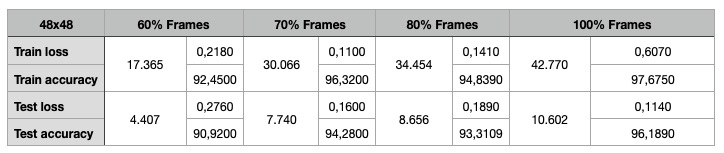
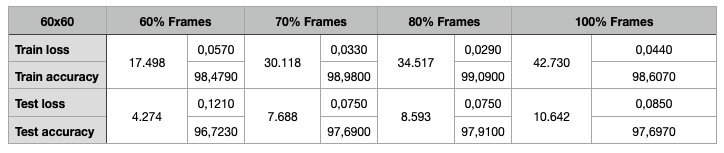

**PIPELINE TO ANALYZE IMAGE/VIDEO DATASETS AND TRAINING TO RECOGNIZE EMOTIONS USING DEEPFACE LIBRARY *(IN PROGRESS)***

Pipeline para extrair frames de vídeos, gerar arquivo CSV para treinar modelo de DeepLearning e analisar o resultado utilizando o framework DeepFace para verificar a mudança de modelos de treinos e comparar sua precisão.

---

Organização arquivos para treino:

Utilizou-se o dataset MEAD (https://wywu.github.io/projects/MEAD/MEAD.html) com vários ficheiros de vídeo categorizados por 8 diferentes emoções, 3 níveis de intensidade, 7 diferentes perspectivas e 48 atores.

Para o treino foram 14 atores (7 mulheres e 7 homens) somente na perspectiva frontal e 7 emoções (angry, disgusted, fear, happy, neutral, sad, surprised). Total de 701 vídeos. Em média 4 segundos cada vídeo.

Para teste separou-se 4 outros atores (2 mulheres e 2 homens).

---

*1a Parte (Extração dos frames dos ficheiros de vídeo):*

**extract_frames_from_file.py**

Extração dos frames de cada vídeo. A resolução original é de 1920x1080.

Para analisar o quão preciso pode ser a análise, separamos a captura de frames em quantidade. Total de 53.372 imagens.

* Analisar 100% dos frames
* Analisar 80% dos frames (Excluindo 10% inicais e 10% finais)
* Analisar 70% dos frames (Excluindo 15% inicais e 15% finais)
* Analisar 60% dos frames (Excluindo 20% inicais e 20% finais)

*2a Parte (Criar ficheiro CSV para treinar modelo)*

**generate_csv_file.py**

Criação do ficheiro CSV com as colunas Emoção e Pixels.

Realizou-se 3 reduções: 48x48, 60x60 e 300x300.

*3a Parte (Treinar o modelo)*

**training_model.py**

Para cada quantidade de frames e resoluções, treinou-se o modelo e gerou ficheiro para utilização futura.

O modelo foi treinado utilizando Deep Learning com CNN.

*4a Parte (Analisar resultado com os modelos treinados)*

**analyze_dataset.py**

Objetivo de analisar todos os modelos treinados utilizando novos frames e conferir precisão baseado na quantidade de frames e resolução treinados.

---

Tensorflow / Modelo "Sequential()"

Para resolução 48x48 foram 625.671 parâmetros

Para resolução 60x60 foram 2.198.535 parâmetros

Para resolução 100x100 foram 10.718.215 parâmetros

